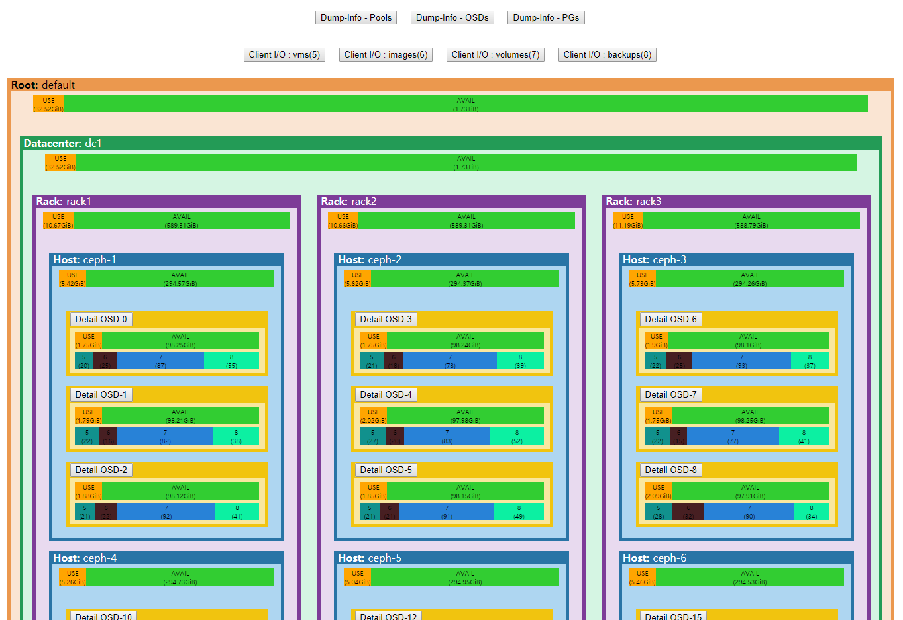

Sonar 4 CEPH (sonar4ceph)
================================


서두
================================

* CEPH 클러스터 운영에 필요한 핵심 정보를 요약/정리/시각화 해보기 위한 프로젝트이며, 통상적인 시스템 정보는 배제되었으며, 오직 CEPH 클러스터에 관련된 정보만을 다룬다.
* MAINTAINER: Jung-In.Jung (call518@gmail.com)
* 2018-12-13 ~ (On-going...)

## 목표

* CRUSH 맵에 기초한 CEPH 클러스터의 논리적 구성 시각화.
* Pool/OSD/PG의 분포 상태 시각화.
* 주요 컴포넌트들의 Health 상태 및 중요 지표 파악.
* 모니터링 부하 최소화.

## 스크린샷 (PoC)




설치
================================

* "Install"이라고 했지만, 특별함은 없다.
* 현재는, 단순 PHP/HTML로만 작성된 PoC 단계라, HTTPd의 Root위치에 배치만 하면 완료.
* 그러나 그냥 되면 재미 없으므로, 일부 요구되는 환경을 필요로 한다.


## 요구 환경

#### PHP >= 5.5

* "array_column" 함수를 필요로 하여, PHP 최소 버전은 5.5 이상 요구됨.


#### CEPH-REST-API (TCP:5000)

* 첫 테스트 시에는 단순 PHP의 "shell_exec()"를 이용해, "ceph {options} -f json" 방식으로 쿼리를 하였으나, 전송 데이터가 증가하고, 빈도수가 많아짐에 따라, 느려짐과 시스템 부하가 커짐.
* 부하를 최소화 하기 위해, "ceph-rest-api"를 ceph 관리자(ceph.admin) 권한으로 실행(TCP:5000)하여 필요한 정보를 요청/수신하게 처리.


## Tutorial

* (Note) CentOS7(x86_64)를 플랫폼을 기준으로 진행하며, 다른 플랫폼이라 해도 큰 차이는 없을 것이라 예상함.

#### Apache(HTTPd) 설치

```bash
yum install -y httpd
```

#### PHP 설치 (>=5.5)

* CentOS7의 기본 PHP는 5.4인 관계로, 3사 Repository를 이용하여 5.6 설치 하여 진행하였음.
  * 참고 문서: https://www.tecmint.com/install-php-5-6-on-centos-7/

```bash
yum install -y epel-release
yum install http://rpms.remirepo.net/enterprise/remi-release-7.rpm
yum install -y yum-utils
yum-config-manager --enable remi-php56
yum install php php-cli php-curl
php -v
PHP 5.6.39 (cli) (built: Dec  5 2018 15:31:03) 
Copyright (c) 1997-2016 The PHP Group
Zend Engine v2.6.0, Copyright (c) 1998-2016 Zend Technologies
```

#### CEPH-REST-API 서비스

* CEPH 노드든 HTTPd서버 노드든 관계 없음. 쿼리 수행만 정상확인 필수.
* CEPH-REST-API 서비스 위치와, "_config.php"의 "$ceph_api" 변수값 일치 확인 필수.
* (Note) 데몬 타입으로 시작 방법을 몰라, 일단 screen을 이용해 진행 중임.....;;;

```bash
screen -dmSL Ceph-REST-API-Service ceph-rest-api -n client.admin
```

#### sonar4ceph 배치

```
git clone https://github.com/call518/sonar4ceph.git
mv sonar4ceph /var/www/html/
```

#### Web 접근

```bash
<브라우져 주소창>

http://{your-http-server-ip-or-name}/sonar4web
```


Completed~~~~~~~~~~~~~~~~~ :)


설정
================================

* 현재는 '설정'이라고 부를만한 것이 딱히 없음.
* 굳이 있다면, "_config.php" 파일 정도?

#### _config.php

* CEPH-REST-API의 엑세스 포인트를 정확히 확인/변경 한다.
* 당연한 이야기지만, 관측에 필요한 모든 데이터 소스가 Rest-API인데, 연결이 안되면 --> :(


히스토리
================================

##### tag v0.0.1

* shell_exec() 방식의 코드본 아카이빙
